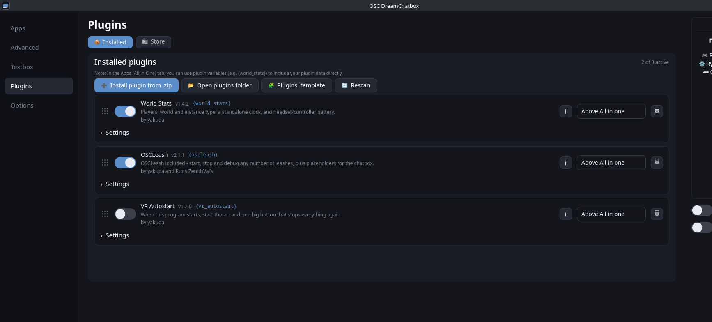
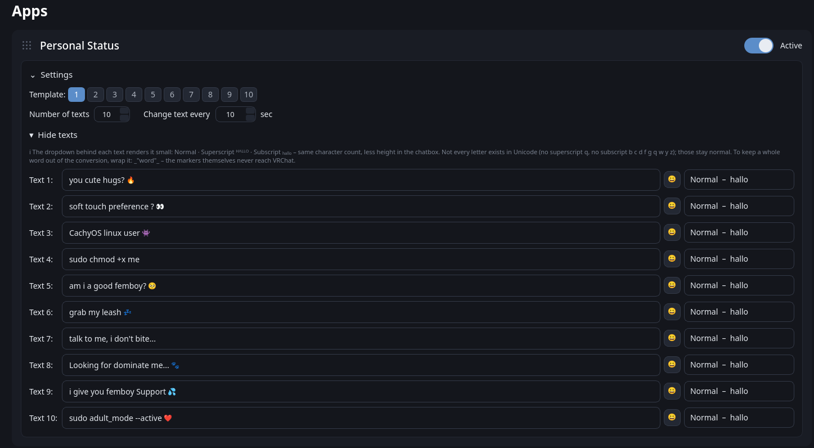
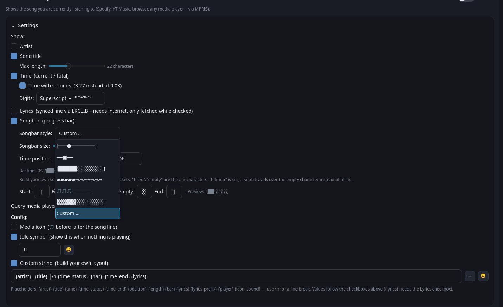
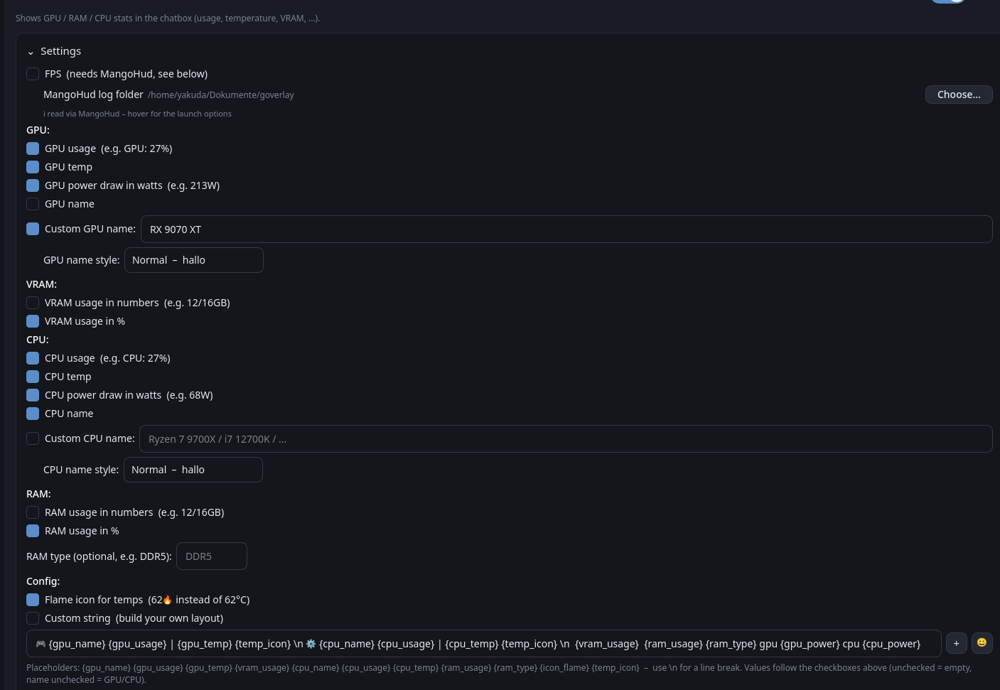
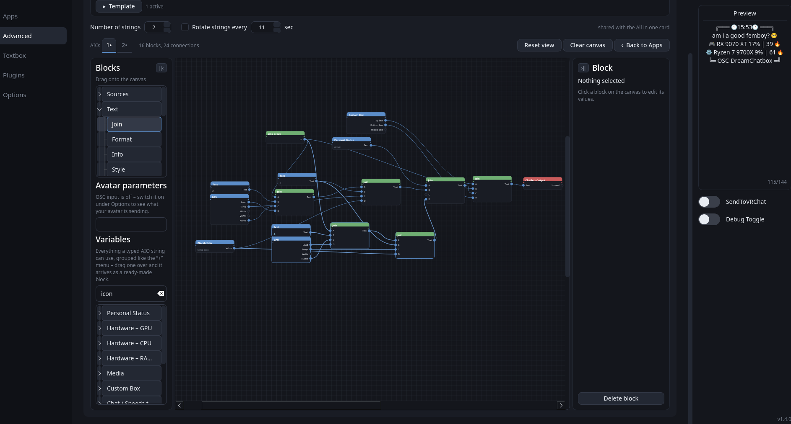
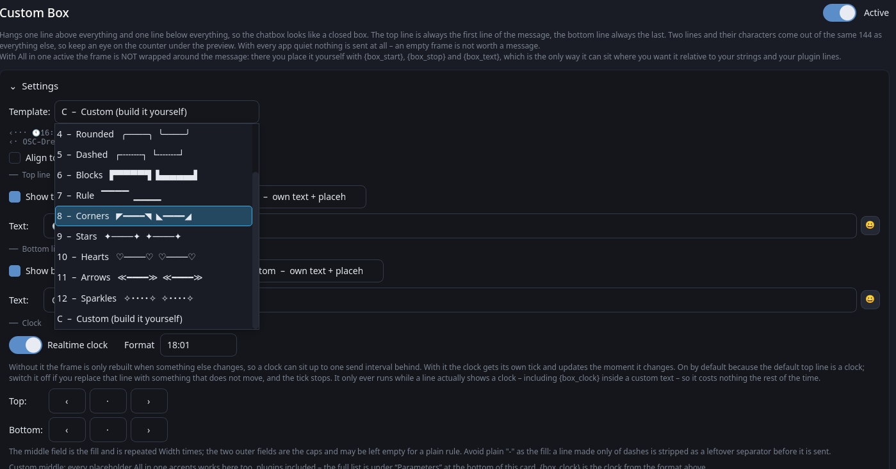
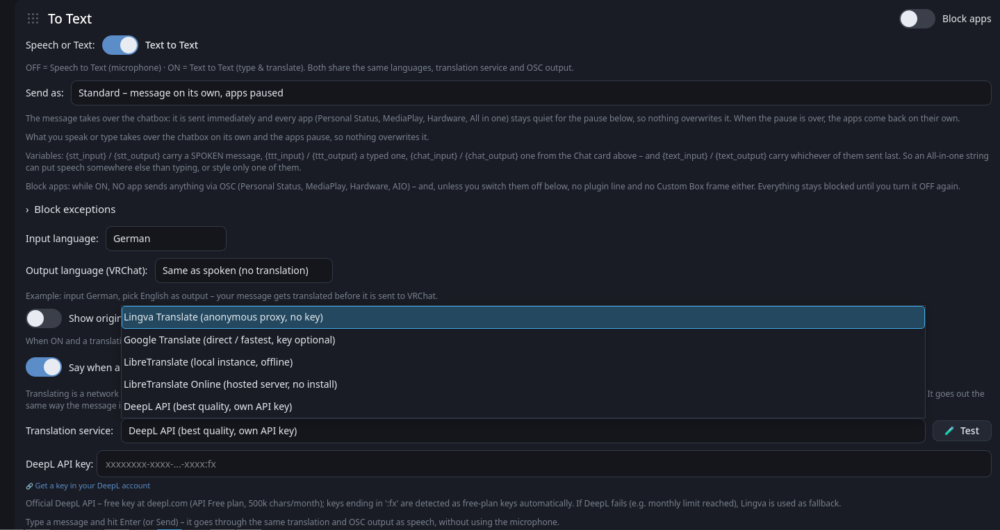
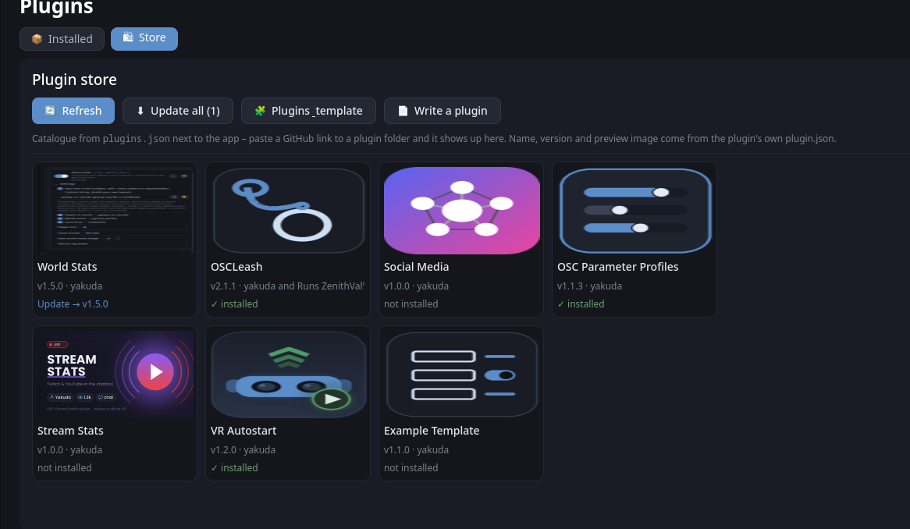
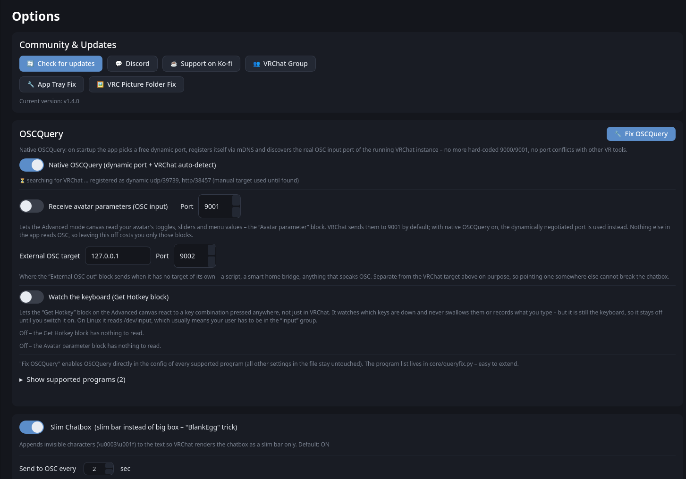
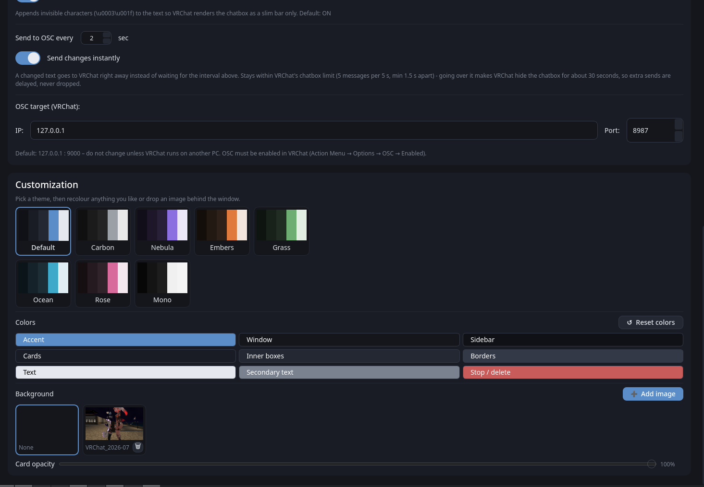

<div align="center">


# 🌙 OSC-DreamChatbox

**A clean, native VRChat OSC chatbox companion for Linux and Windows.**

*Born as the native Linux alternative to [MagicChatbox](https://github.com/BoiHanny/vrcosc-magicchatbox) (VRCOSC) — now at home on both.*

[](LICENSE)
[]()
[]()
[](https://aur.archlinux.org/packages/osc-dreamchatbox)
[](https://www.youtube.com/watch?v=XJFplUvuGVs)
[](https://discord.gg/X5TaN4A47h)
[](https://ko-fi.com/yakuda_)



</div>

---

## 🎬 Video

A full walkthrough of the app — every page, every card, in one go:

<div align="center">

<a href="https://www.youtube.com/watch?v=XJFplUvuGVs">
  
</a>

**▶ [Watch on YouTube](https://www.youtube.com/watch?v=XJFplUvuGVs)**

</div>

---

## ✨ In short

Status rotation, now-playing, hardware stats, speech-to-text, live translation, a node canvas, plugins and the slim-chatbox trick — one PyQt6 app that talks to the system services each platform actually has.

| | |
|---|---|
| 📝 **Personal Status** | 10 templates × 20 texts, rotating, with icon picker |
| 🎵 **MediaPlay** | Spotify / YT Music / VLC / browser — title, time, songbar, synced lyrics |
| 🖥️ **Hardware** | GPU / CPU / RAM / VRAM, temps, watts, FPS |
| 🧩 **All in one** | Merge everything into one master string, 10 layouts |
| 🕸️ **Advanced mode** | A node canvas that builds the line visually — 34 blocks |
| 🖼️ **Custom Box** | A frame around the chatbox, 12 templates + custom |
| 💬 **Textbox & STT** | Type or speak, live translation into 13 languages |
| 🧩 **Plugins** | Own page with store, install from GitHub in one click |
| 🎨 **Themes** | 8 themes, full recolouring, background images |
| 📡 **OSCQuery** | Native, dynamic port, VRChat auto-discovery |

---

> 🤖 **Transparency Note:** This project and its documentation are proudly developed and optimized with the support of AI coding assistants (**Claude by Anthropic** & **Gemini**).

---

## 📑 Contents

- [Installation](#-installation)
- [Apps — Personal Status](#-personal-status)
- [MediaPlay](#-mediaplay)
- [Hardware](#️-hardware)
- [All in one (AIO)](#-all-in-one-aio)
- [Advanced mode — the node canvas](#️-advanced-mode--the-node-canvas)
- [Custom Box](#️-custom-box)
- [Textbox, Speech to Text & translation](#-textbox-speech-to-text--translation)
- [Plugins](#-plugins)
- [Options — OSCQuery, slim chatbox, OSC target](#-options--oscquery-slim-chatbox-osc-target)
- [Themes & customization](#-themes--customization)
- [Platform support](#-platform-support)
- [Optional features](#optional-features)
- [Project structure](#-project-structure)
- [Important](#️-important)
- [Legal & credits](#legal--credits)

---

## 🚀 Installation

<details open>
<summary><b>🐧 Linux</b></summary>

**Arch Linux / CachyOS (AUR) — recommended**

```bash
yay -S osc-dreamchatbox      # or: paru -S osc-dreamchatbox
```

**One-line install (any distro)**

```bash
curl -sL https://raw.githubusercontent.com/yakuda-stack/OSC-DreamChatbox/main/install.sh | bash
```

Then launch **OSC DreamChatbox** from your app menu or run `osc-dreamchatbox`.

<details>
<summary>Without an AUR helper (plain <code>makepkg</code>)</summary>

```bash
git clone https://aur.archlinux.org/osc-dreamchatbox.git
cd osc-dreamchatbox
makepkg -si
```
</details>

<details>
<summary>Manual (any distro)</summary>

```bash
git clone https://github.com/yakuda-stack/OSC-DreamChatbox.git
cd OSC-DreamChatbox
python3 -m venv venv
./venv/bin/pip install -r requirements.txt
./venv/bin/python osc_dreamchatbox.py
```
</details>

</details>

<details open>
<summary><b>🪟 Windows 10 / 11</b></summary>

**Installer (recommended)**

Grab `OSC-DreamChatbox-<version>-setup.exe` from the **[releases page](https://github.com/yakuda-stack/OSC-DreamChatbox/releases)** and run it. It installs per user, so there is no UAC prompt.

Your config lives in `%APPDATA%\OSC-DreamChatbox` and **survives an uninstall** — settings, plugins and themes are still there after a reinstall.

<details>
<summary>From source</summary>

```powershell
git clone https://github.com/yakuda-stack/OSC-DreamChatbox.git
cd OSC-DreamChatbox
py -m venv venv
.\venv\Scripts\Activate.ps1
pip install -r requirements-windows.txt
python osc_dreamchatbox.py
```

If PowerShell blocks the activation:
`Set-ExecutionPolicy -Scope Process -ExecutionPolicy Bypass`
</details>

<details>
<summary>Build the .exe yourself</summary>

```powershell
.\packaging\windows\build-exe.ps1 -NoConsole
```

Full details, including the `MSVCP140.dll` trap, in **[packaging/windows/README-BUILD.md](packaging/windows/README-BUILD.md)**.
</details>

</details>

> **Don't forget:** OSC has to be on in VRChat — Action Menu (radial) → **Options → OSC → Enabled**.

---

## 📝 Personal Status

Rotating one-liners about you — the card everyone starts with.



<details>
<summary><b>Details</b></summary>

- **10 switchable text templates**, each with its own set of up to **20 texts** — exclusive toggles, enabling one switches the others off
- Adjustable change interval (10 s minimum); texts switch **randomly** (never the same one twice in a row) and are pushed to VRChat the moment they change
- Per text a **size style**: Normal · Superscript ᴴᴬᴸᴸᴼ · Subscript — same character count, less height in the chatbox
- Text fields fold in/out so the card stays compact
- Built-in **icon picker** (🔥 🎵 🎮 …) for every text field

</details>

---

## 🎵 MediaPlay

Shows what you are listening to — **Spotify, Apple Music, YT Music, browsers, VLC, any player**. Linux: MPRIS over D-Bus · Windows: the system media session. No extra setup either way.



<details>
<summary><b>Details</b></summary>

- Toggle artist / title (adjustable max length) / time / progress songbar individually
- Time with or without seconds, and the digits can be rendered as **superscript** to save height
- **Synced lyrics** via LRCLIB — the current line, only fetched while the checkbox is on
- **Songbar size slider** and **time position** — put the time before, after or around the bar so everything fits on **one line**:
  `0:27/1:06 ▓▓▓▓░░░░` · `▓▓▓▓░░░░ 0:27/1:06` · `0:27▓▓▓▓░░░░1:06`
- **7 songbar styles (6 presets + custom)**:

  | # | Style |
  |---|---|
  | 1 | `[───●────────────────]` |
  | 2 | `──■──` |
  | 3 | `[████████░░░░░░░░░░░░]` |
  | 4 | `▰▰▰▰▰▰▰▰▰▰▱▱▱▱▱▱▱▱▱▱` |
  | 5 | `🎵🎵🎵🎵🎵🎵🎵─────────────` |
  | 6 | `▓▓▓▓▓▓▓▓░░░░░░░░░░░░` (classic) |
  | 7 | **Custom** — brackets, filled/empty chars, optional travelling knob, live preview |

- Custom string with placeholders: `{artist} {title} {time} {time_status} {time_end} {position} {length} {bar} {lyrics} {player} {icon_sound}`
- **Idle symbol**: shows `⏸` (editable) when nothing is playing instead of the line silently disappearing — or switch it off. Works in **All in one** too; `{media_idle}` places it by hand

</details>

---

## 🖥️ Hardware

Live GPU / VRAM / CPU / RAM stats in the chatbox.



<details>
<summary><b>Details</b></summary>

- Auto-detected or custom GPU/CPU names, temps as `°C` or 🔥
- **Power draw in watts** — one tick per section puts it next to the temperature (`GPU: 68% 61°C 213W`) and fills `{gpu_power}` / `{cpu_power}`. Off by default, so no existing line gets longer without being asked. NVIDIA always reports it; AMD needs amdgpu's hwmon node, CPU watts need zenpower or readable RAPL counters, and on Windows both come from LibreHardwareMonitor
- **FPS** — neither OS can read a game's frame rate on its own, so it comes from an overlay that already sits inside VRChat. **Linux:** MangoHud's log, point the card at the folder and add the launch options shown there. **Windows:** RTSS (ships with MSI Afterburner) — nothing to configure, the card links the download
- Custom string with placeholders: `{gpu_name} {gpu_usage} {gpu_temp} {gpu_power} {temp_icon} {vram_usage} {cpu_name} {cpu_usage} {cpu_temp} {cpu_power} {ram_usage} {ram_type} {fps}`

**About CPU temperatures on Windows:** they live in registers only kernel-mode code can read, so *no* normal program can get them — administrator rights do not change that. Every tool that shows them ships a signed kernel driver. This app does **not** ship one (the usual candidate, WinRing0, has published privilege-escalation CVEs). Instead the Hardware card has a button that starts a small elevated helper reading everything reachable without a driver — ACPI thermal zones, which work on most laptops — and drives [LibreHardwareMonitor](https://github.com/LibreHardwareMonitor/LibreHardwareMonitor) if you have it installed, which does have the driver. On desktop boards you will most likely need LHM; the button links it.

</details>

---

## 🧩 All in one (AIO)

Combine **everything into one master string** instead of one line per card.

<details>
<summary><b>Details</b></summary>

- Up to **10 rotating layouts**, and **10 switchable AIO templates**, each with its own set of strings — flip between a gaming, a music and a minimal layout with one click
- **Multi-line fields**: each string field is 3 rows tall and shows the message the way it comes out. **Shift+Enter** starts a new chatbox line (stored as `\n`, so existing strings keep working). The field grows with the text; drag the bottom edge to pin a height, double-click it to grow again
- **Custom time per string**: tick it on a field and that one string stays on screen for its own number of seconds instead of the shared *Rotate strings every N sec*
- All placeholders from every app work here, incl. `{text_1}…{text_20}`, `{time_status}`, `{time_end}`, plus every active plugin as `{plugin_id}`
- **Parameters** — an expander at the bottom of the card listing the complete vocabulary: **Software parameters** (everything the app produces, grouped by app) and **External parameters** (every installed plugin with its `{<id>}` and `{<id>_<key>}` values). Rebuilt whenever the plugin list changes
- **Text styles inline**: `{super/"word"}` and `{sub/"word"}` make one part of any custom string small — `GPU {gpu_usage} {super/"vram"} {vram_usage}` → `GPU 68% ⱽᴿᴬᴹ 9/16GB`. Works in Hardware, All in one, MediaPlay, the status texts, a Custom Box middle and plugin strings, and the content may be a placeholder: `{super/{cpu_temp}}`

</details>

---

## 🕸️ Advanced mode — the node canvas

A **Mode switch** on the All in one card: *Normal* is the text fields, *Advanced* points at a canvas where the line is wired together from blocks. Nothing is converted when you switch, so it is reversible at any time.



<details>
<summary><b>Details</b></summary>

- Blocks palette on the left, canvas in the middle, the selected block's values on the right — both side panels fold away. Drag a block out of the palette, drag from an output dot to an input dot to wire it; middle mouse pans, the wheel zooms, Delete removes the selection
- **One canvas per AIO string**, picked with tabs above the canvas, and each of the ten AIO templates keeps its own set of canvases
- **34 blocks**: Sources (Text, Placeholder, Personal Status, GPU, CPU, RAM & System, MediaPlay, Chat/STT, Clock, Custom Box), Text (Join with 2–10 inputs, Format, Info, Style, Truncate, Line break), Logic (If/Else, Compare, Has value), Flow (Timer, Step, Button, Change AIO), OSC, Output, System and Hotkeys
- Every placeholder a typed string can use is **draggable out of a grouped Variables list**, plugins included
- **OSC input**: a listener that keeps the last value of every avatar parameter, with a picker so names are chosen rather than typed, plus blocks to read them and to write bool/int/float back
- **External OSC in/out** for any address, so other tools on the machine can drive the chatbox and be driven by it
- **Send Hotkey / Get Hotkey**: press a key combination at the operating system, or react to one pressed anywhere. SendInput on Windows; xdotool, wtype or ydotool on Linux, python-evdev for watching
- **Program running / Start program**: notice that VRChat came up and launch things with it
- Blocks with side effects run **only on a real send, never on the preview**

</details>

---

## 🖼️ Custom Box

A frame around the whole chatbox: one line above everything, one line below it.

```
┌──────┐            ┌─── 18:01 ───┐
now playing …  ->   now playing …
└──────┘            └─── 68 % ───┘
```



<details>
<summary><b>Details</b></summary>

- Ships **switched off but pre-configured** — turn it on and you get a clock on top, app name underneath
- **12 templates** (Light, Heavy, Double, Rounded, Dashed, Blocks, Rule, Corners, Stars, Hearts, Arrows, Sparkles) plus a **custom slot** where you set the six characters a frame is made of — in a dropdown that shows each frame next to its name
- **Own width per line** — a short clock on top and a long hardware line underneath can each get the fill they need
- Each line switchable on its own, plus **Align top & bottom** which pads the shorter line when you *do* want them even
- Every line can carry a **middle text**: nothing, a **clock** (four formats), or your **own string with all the All-in-one placeholders** — `{cpu_usage}`, `{title}`, plugins, everything
- **Realtime clock is a toggle and off by default** — it is the only part that costs anything, and it only ticks while a line is actually set to Clock
- Prefer to place the frame yourself? `{box_start}`, `{box_stop}` and `{box_text}` work in any **All in one** string and are not added twice

</details>

---

## 💬 Textbox, Speech to Text & translation

Type it or speak it — either way it goes to VRChat, optionally translated on the way.



<details>
<summary><b>Details</b></summary>

- Free chat field → sends straight to VRChat, apps pause briefly so nothing overwrites your message
- **Editable presets** (default 5, expandable to 20) with one-click send
- **Speech to Text** 🎤 — speak, it transcribes in realtime and sends to VRChat
- **Microphone selection** dropdown (system default or any input device)
- 15 input languages, **live translation** to 13 output languages
- **Four translation services**: Lingva Translate (default — anonymous proxy, no key, no Google tracking), Google Translate direct (fastest, key optional), LibreTranslate (local instance, 100 % offline — install once, then a **Start/Stop server button** appears right in the UI and the server is shut down when the app closes) or the official **DeepL API** (own key, typed error handling). A hosted LibreTranslate is there too if you don't want to install one
- Automatic fallback chain if the chosen service fails: **Lingva first, then direct Google** (e.g. DeepL monthly limit reached or local instance down)
- **"Say when a translation is running"** — the gap between speaking and the translation arriving says `Translate …` instead of leaving the previous message up
- **Send as**: Standard (message takes over, apps pause), or routed into your own placeholders — `{stt_input}` / `{stt_output}` carry a spoken message, `{ttt_input}` / `{ttt_output}` a typed one, `{text_input}` / `{text_output}` whichever sent last
- **"Block apps"** toggle that pauses every automatic sender while you talk, with per-app exceptions
- All cards freely **drag & drop reorderable** — card order = line order in VRChat

</details>

---

## 🧩 Plugins

Own **Plugins** page with two tabs: **Installed** and **Store**.

<table>
<tr>
<td width="50%"><b>Installed</b><br></td>
<td width="50%"><b>Store</b><br></td>
</tr>
</table>

<details>
<summary><b>Details</b></summary>

- A plugin is one folder with a `plugin.json` and a python file in `~/.config/OSC-DreamChatbox/plugins/` — install from a `.zip` or straight from the store
- **Store**: a grid of tiles with preview image, version and author; click one for the full description and a single Install button. Updates are detected and applied with one click, and your settings survive them
- **One-click update in the Installed list** — a plugin with a newer version on GitHub gets an **Update to vX** button right in its row, plus **"Update all (n)"** above the list when more than one is waiting
- The catalogue is a list of GitHub links in `config/plugins.json`; **Refresh pulls the current list from GitHub**, so new plugins appear without updating the app
- Every plugin is usable as `{plugin_id}` in status texts, in the Apps custom strings and in All in one — with its own custom string, if you set one
- **Per-plugin settings** declared in `plugin.json` (text, switch, number, slider, dropdown, path, secret, action button, collapsible groups) are rendered automatically — a plugin author gets a settings UI without writing any Qt
- `is_linux` / `is_windows` flags mark what a plugin can run on; anything incompatible is greyed out rather than hidden. Each row has a 🗑 button to uninstall it
- Crash-safe by design: a broken plugin logs a traceback to the debug console and is skipped, it can never take the chatbox down
- In the store: **World Stats** (players in your instance, world name, local clock, headset/controller battery), **OSCLeash** (runs ZenithVal's OSCLeash, which ships inside the plugin — nothing to install), **VR Autostart**, **Social Media** and **Stream Stats**
- [**example_template**](https://github.com/yakuda-stack/Dream-Chatbox-Plugins/tree/main/template/example_template) to start your own: a plugin that actually runs, with every setting type next to every hook. Copy the folder, rename it, delete what you don't need

</details>

---

## 📡 Options — OSCQuery, slim chatbox, OSC target



<details>
<summary><b>Details</b></summary>

**Native OSCQuery** — no hard-coded ports anymore: the app picks a **free dynamic port**, registers itself via **mDNS/Zeroconf** (`_oscjson._tcp` + `_osc._udp`) and serves OSCQuery `HOST_INFO` over HTTP. The running **VRChat instance is auto-discovered** and its real OSC input port is used automatically — the manual target is only a fallback.

**OSCQuery Fix** — one button enables OSCQuery directly in the config of every supported program, other settings stay untouched. Currently **OSCLeash** and **OscGoesBrrr**; only files that already exist are touched, never created. Easily extensible in `core/queryfix.py`.

**Slim Chatbox (default ON)** — appends the invisible characters `\u0003\u001f` so VRChat renders a **slim bar instead of the huge box** (the hidden "BlankEgg" trick from MagicChatbox — here it's just a normal setting). The suffix is guaranteed to survive even at the 144-char limit.

**Send changes instantly** — a changed text goes to VRChat right away instead of waiting for the interval, while staying inside VRChat's rate limit (5 messages per 5 s, min 1.5 s apart). Extra sends are delayed, never dropped.

**Also here:** update checker, Discord / Ko-fi / VRChat group links, app tray fix, VRC picture folder fix, avatar parameter input, external OSC target, keyboard watching for the Get Hotkey block, debug console.

</details>

---

## 🎨 Themes & customization

Pick a theme, then recolour anything you like — or drop an image behind the window.



<details>
<summary><b>Details</b></summary>

- **8 UI themes** shown as colour swatches — Default, Carbon, Nebula, Embers, Grass, Ocean, Rose, Mono
- Recolour **any** part of the active theme with a colour picker (accent, window, cards, inner boxes, borders, text …); overrides are kept per theme
- **Background images** — import your own, switch between them, and adjust how solid the cards sit on top

</details>

---

## 🖧 Platform support

### 🟢 Linux: complete & stable (since v1.2.6)

All core features (chatbox sync, caching, STT, live translation, AUR packaging) are fully optimized for Linux systems.

### 🟢 Windows: complete & stable (since v1.3.0)

The app runs natively on Windows 10/11 — not through Wine, not as a port, but on the same codebase. Every platform-dependent piece sits behind a switch in `core/osinfo.py` and has a real backend on both sides.

| Feature | 🐧 Linux | 🪟 Windows |
|---|---|---|
| Now playing | MPRIS over D-Bus | GSMTC — the media session Windows uses for its own media keys |
| CPU / RAM | `/proc`, `/sys` | `GetSystemTimes()`, `GlobalMemoryStatusEx()` |
| GPU / VRAM | sysfs (AMD), `nvidia-smi` | `nvidia-smi`, otherwise the same GPU performance counters the Task Manager reads |
| Temperatures | hwmon | `nvidia-smi`; for CPU and AMD/Intel GPU a helper you start from the Hardware card |
| FPS | MangoHud log | RTSS shared memory (ships with MSI Afterburner) |
| Microphone | PyAudio | sounddevice (PyAudio has no wheels past Python 3.13) |
| Config | `~/.config/OSC-DreamChatbox` | `%APPDATA%\OSC-DreamChatbox` |

Where a platform genuinely cannot do something, the value stays empty and the card says why — nothing is faked.

### Optional features

| Feature | 🐧 Linux | 🪟 Windows |
|---|---|---|
| Speech to Text | `pyaudio` (Arch: `python-pyaudio`) — or simply `pip install sounddevice` | `pip install sounddevice` (**not** `pyaudio`: no wheels past Python 3.13) |
| | `SpeechRecognition` installs itself with one button in the Speech to Text card | same button |
| Now playing | nothing — MPRIS is already there | `pip install "winrt-Windows.Media.Control[all]"` (**not** `winsdk`: no wheels past Python 3.12) |
| DeepL translation | `deepl` (official library) | same |
| Offline translation | `pip install libretranslate`, then Start/Stop right in the UI | same |
| Exact GPU name | `mesa-utils` (glxinfo) | not needed — read from the driver/registry |
| NVIDIA stats | `nvidia-smi` (driver package) | `nvidia-smi` (ships with the driver) |
| CPU / GPU temperatures | hwmon, already there | [LibreHardwareMonitor](https://github.com/LibreHardwareMonitor/LibreHardwareMonitor) — the Hardware card starts it for you |
| FPS readout | `mangohud`, started with logging | [RTSS](https://www.guru3d.com/download/rtss-rivatuner-statistics-server-download/) / MSI Afterburner, just running |

---

## ⚠️ Important

**OSC must be enabled in VRChat**: Action Menu (radial) → **Options → OSC → Enabled**

Default target is `127.0.0.1:9000`. VRChat's chatbox limit is 144 characters (the slim trick uses 2 of them).

**🪟 Windows, first start:** the firewall will ask whether the app may use the network. That is mDNS (UDP 5353) for OSCQuery, which is how VRChat's real OSC port is discovered. Say yes — if you decline, everything still works, but the app falls back to the fixed port 9000.

> ℹ️ The former **OSC Routing** and **Addons/OSC Apps** features were removed — external tools (OSCLeash, face tracking, …) handle port discovery via **OSCQuery** nowadays, so the built-in relay and installer were unnecessary ballast.

---

## 📁 Project structure

<details>
<summary><b>Show the tree</b></summary>

```
OSC-DreamChatbox/
├── osc_dreamchatbox.py   # entry point (GUI starter)
├── core/                 # backend logic
│   ├── osinfo.py         #   THE platform switch - the only place that
│   │                     #   asks which OS this is, plus config paths
│   ├── constants.py      #   app name, version, paths
│   ├── textutils.py      #   time format, songbar styles, templates
│   ├── textstyle.py      #   superscript / subscript rendering
│   ├── boxstyle.py       #   Custom Box frame templates + line building
│   ├── emojis.py         #   emoji picker palette (10 categories)
│   ├── queryfix.py       #   OSCQuery fixer (supported programs list)
│   ├── oscquery.py       #   native OSCQuery (mDNS + dynamic ports)
│   ├── nodegraph_eval.py #   Advanced mode: node graph evaluation
│   ├── hotkeys.py        #   send / watch key combinations
│   ├── translators.py    #   translation backends (Lingva/Google/Libre/DeepL)
│   ├── mediafetch.py     #   picks the media backend for this OS
│   ├── hardware.py       #   picks the hardware backend for this OS
│   ├── speechtotext.py   #   speech recognition + translation
│   ├── plugins.py        #   plugin discovery, loading, settings
│   ├── plugin_store.py   #   store: GitHub catalogue, install, updates
│   ├── theming.py        #   UI themes, colours, background images
│   └── backends/         #   one implementation per platform
│       ├── hardware_linux.py     /proc, /sys, nvidia-smi, MangoHud
│       ├── hardware_windows.py   Win32 API, PDH counters, nvidia-smi, RTSS
│       ├── hardware_null.py      every value None (unsupported platform)
│       ├── media_linux.py        MPRIS over D-Bus
│       ├── media_windows.py      GSMTC (system media session)
│       ├── media_null.py         nothing playing, ever
│       ├── mic_sounddevice.py    microphone without PyAudio
│       └── wintemp.py            elevated temperature helper (Windows)
├── config/
│   └── plugins.json      #   store catalogue (GitHub links)
├── ui/                   # UI widgets & stylesheet
│   ├── mainwindow.py     #   main window shell + page switching
│   ├── config_mixin.py   #   config load/save/validation
│   ├── nodegraph.py      #   Advanced mode canvas
│   ├── aio_edit.py       #   multi-line AIO string editor
│   ├── pages/            #   one file per page
│   │   ├── apps_page.py
│   │   ├── custom_box.py
│   │   ├── textbox_page.py
│   │   ├── plugins_page.py
│   │   └── options_page.py
│   └── ui_main.py
├── assets/               # icons & screenshots
├── packaging/
│   ├── aur/              #   AUR PKGBUILD + .desktop file
│   └── windows/          #   Windows build
│       ├── osc-dreamchatbox.spec   PyInstaller recipe
│       ├── build-exe.ps1           one-command build
│       ├── build-exe.bat           double-click wrapper
│       ├── installer.iss           Inno Setup installer
│       ├── dreamtemp-helper.ps1    elevated temperature helper
│       └── README-BUILD.md         full build guide
├── install.sh            # one-line installer (Linux)
├── scripts/              # build scripts (AppImage)
├── start.sh              # run from a local venv (Linux)
├── requirements.txt          # Linux
├── requirements-windows.txt  # Windows
├── LICENSE               # GPL-3.0
└── THIRD_PARTY_NOTICES.md   # dependency & service attribution
```

</details>

---

## ❤️ Support

- 💬 [Discord](https://discord.gg/X5TaN4A47h)
- 👥 [VRChat group](https://vrchat.com/home/group/grp_829b7777-430d-48b2-8bf3-4e348d0dac9b)
- ☕ [Support me on Ko-fi](https://ko-fi.com/yakuda_)
- 📋 [Changelog](CHANGELOG.md) · 🧩 [Plugin API](docs/PLUGIN_API.md)

---

## Legal & Credits

* **Independence:** OSC-DreamChatbox is an independent open-source implementation and is not affiliated with, endorsed by, or using code from MagicChatbox.
* **Trademarks:** VRChat is a registered trademark of VRChat Inc. This project is an independent third-party tool and is not affiliated with or endorsed by VRChat Inc.
* **Lyrics:** Song lyrics displayed by the app are provided via LRCLIB and remain the intellectual property of their respective copyright holders.
* **Translation endpoints:** Lingva is the default and needs no key. If you pick *Google Translate* you can enter your **own API key**, which routes the request through the official Google Cloud Translation API (your project, your quota). Without a key the app falls back to the unofficial, undocumented Google endpoint — shared by everyone and throttled or blocked by Google at any time, so **use at your own risk**. For heavy or reliable use, enter an API key or run LibreTranslate locally.
* **Third-party licenses:** A full list of every dependency, external service and system tool — with licenses, attribution and the GPL/LGPL source offer for the AppImage — is in [THIRD_PARTY_NOTICES.md](THIRD_PARTY_NOTICES.md).

## 📄 License

GPL-3.0-or-later — see [LICENSE](LICENSE).
Copyright (C) 2026 yakuda.

This program is free software: you can redistribute it and/or modify it under the terms of the GNU General Public License as published by the Free Software Foundation, either version 3 of the License, or (at your option) any later version. It is distributed in the hope that it will be useful, but WITHOUT ANY WARRANTY; without even the implied warranty of MERCHANTABILITY or FITNESS FOR A PARTICULAR PURPOSE.
