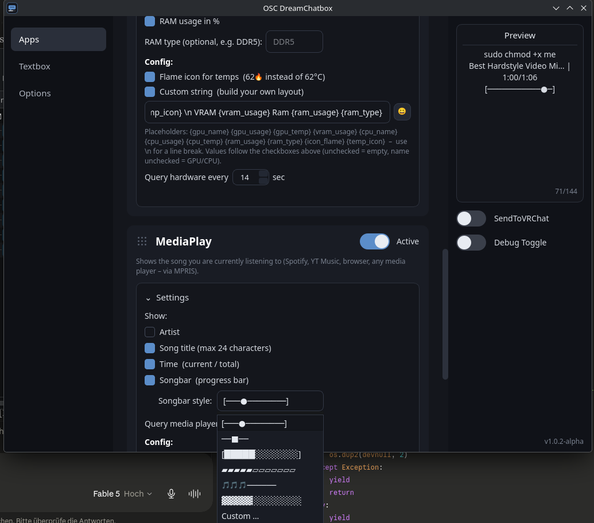

<div align="center">

# 🌙 OSC-DreamChatbox

**A simple, clean VRChat OSC chatbox companion for Linux and Windows.**
*Born as the native Linux alternative to [MagicChatbox](https://github.com/BoiHanny/vrcosc-magicchatbox) (VRCOSC) – now at home on both.*

[](LICENSE)
[]()
[]()
[](https://discord.gg/X5TaN4A47h)
[](https://ko-fi.com/yakuda_)

</div>

---

## ✨ What can it do?

Status rotation, now-playing, hardware stats, speech-to-text, live translation, plugins, the slim-chatbox trick – one PyQt6 app that talks to the system services each platform actually has.

*(Personal Status, MediaPlay, Hardware and All-in-one live on the **Apps** page. Plugins have their own page, theming sits under Options.)*


### 🟢 Linux Support: Complete & Stable (v1.2.6)

    As of version 1.2.6, the Linux version of the OSC Dream Chatbox is fully completed, tested, and stable.
    All core features (chatbox sync, caching, STT, live translation, AUR packaging) are fully optimized for Linux systems.

### 🟢 Windows Support: Complete & Stable (v1.3.0)

    As of version 1.3.0 the app runs natively on Windows 10/11 - not through Wine, not as a port,
    but on the same codebase. Every platform-dependent piece sits behind a switch in core/osinfo.py
    and has a real backend on both sides.

**How the two platforms get the same features from different places**

| Feature | Linux | Windows |
|---|---|---|
| Now playing | MPRIS over D-Bus | GSMTC – the media session Windows uses for its own media keys |
| CPU / RAM | `/proc`, `/sys` | `GetSystemTimes()`, `GlobalMemoryStatusEx()` |
| GPU / VRAM | sysfs (AMD), `nvidia-smi` | `nvidia-smi`, otherwise the same GPU performance counters the Task Manager reads |
| Temperatures | hwmon | `nvidia-smi`; for CPU and AMD/Intel GPU a helper you start from the Hardware card (see below) |
| FPS | MangoHud log | RTSS shared memory (ships with MSI Afterburner) |
| Microphone | PyAudio | sounddevice (PyAudio has no wheels past Python 3.13) |
| Config | `~/.config/OSC-DreamChatbox` | `%APPDATA%\OSC-DreamChatbox` |

Where a platform genuinely cannot do something, the value stays empty and the card says why – nothing is faked.

**About CPU temperatures on Windows:** they live in registers only kernel-mode code can read, so *no* normal program can get them – administrator rights do not change that. Every tool that shows them ships a signed kernel driver. This app does **not** ship one (the usual candidate, WinRing0, has published privilege-escalation CVEs). Instead the Hardware card has a button that starts a small elevated helper reading everything reachable without a driver – ACPI thermal zones, which work on most laptops – and drives [LibreHardwareMonitor](https://github.com/LibreHardwareMonitor/LibreHardwareMonitor) if you have it installed, which does have the driver. On desktop boards you will most likely need LHM; the button links it.


### 📝 Personal Status
- **10 switchable text templates**, each with its own set of up to **20 texts** – exclusive toggles, enabling one switches the others off
- Adjustable change interval (10 s minimum); texts switch **randomly** (never the same one twice in a row) and are pushed to VRChat the moment they change
- Text fields fold in/out so the card stays compact
- Built-in **icon picker** (🔥 🎵 🎮 …) for every text field

### 🎵 MediaPlay
- Shows the song you are listening to – **Spotify, Apple Music, YT Music, browsers, VLC, any player** (Linux: MPRIS/D-Bus · Windows: the system media session – no extra setup either way)
- Toggle artist / title (max 24 chars) / time / progress songbar individually
- Time is shown **without seconds** (hours:minutes, e.g. `0:03/0:04`)
- **Songbar size slider (30–100 %)** and **time position** – put the time before, after or around the bar so everything fits on **one line**:
  - `0:27/1:06 ▓▓▓▓░░░░` · `▓▓▓▓░░░░ 0:27/1:06` · `0:27▓▓▓▓░░░░1:06`
- **7 songbar styles (6 presets + custom)**:

  | # | Style |
  |---|---|
  | 1 | `[───●────────────────]` |
  | 2 | `──■──` |
  | 3 | `[████████░░░░░░░░░░░░]` |
  | 4 | `▰▰▰▰▰▰▰▰▰▰▱▱▱▱▱▱▱▱▱▱` |
  | 5 | `🎵🎵🎵🎵🎵🎵🎵─────────────` |
  | 6 | `▓▓▓▓▓▓▓▓░░░░░░░░░░░░` (classic) |
  | 7 | **Custom** – build your own (brackets, filled/empty chars, optional knob) with live preview |

- Custom string with placeholders: `{artist} {title} {time} {time_status} {time_end} {bar} {icon_sound}`

- **Idle symbol**: shows `⏸` (editable) when nothing is playing, instead of the line silently disappearing – or switch it off. Works in **All in one** too: a template line that is about the song and came out empty becomes the symbol. `{media_idle}` places it by hand

### 🖥️ Hardware
- Live **GPU / VRAM / CPU / RAM** stats (Linux: sysfs + nvidia-smi · Windows: Win32 API, nvidia-smi and GPU performance counters)
- Auto-detected or custom GPU/CPU names, temps as `°C` or 🔥
- **FPS** – neither OS can read a game's frame rate on its own, so it comes from an overlay that already sits inside VRChat. **Linux:** MangoHud's log, point the card at the folder and add the launch options shown there. **Windows:** RTSS (ships with MSI Afterburner) – nothing to configure, the card links the download
- Custom string with placeholders: `{gpu_name} {gpu_usage} {gpu_temp} {temp_icon} {vram_usage} {cpu_name} {cpu_usage} {cpu_temp} {ram_usage} {ram_type} {fps}`

### 🧩 All in one (AIO)
- Combine **everything into one master string** – up to 5 rotating layouts
- **10 switchable AIO templates**, each with its own set of strings – flip between a gaming, a music and a minimal layout with one click, same as the Personal Status templates
- All placeholders from every app work here, incl. `{text_1}…{text_20}`, `{time_status}`, `{time_end}`, plus every active plugin as `{plugin_id}`
- **Parameters** – an expander at the bottom of the card listing the complete vocabulary: **Software parameters** (everything the app produces, grouped by app) and **External parameters** (every installed plugin with its `{<id>}` and `{<id>_<key>}` values). Selectable text, rebuilt whenever the plugin list changes

- **Text styles inline**: `{super/"word"}` and `{sub/"word"}` make one part of any custom string small – `GPU {gpu_usage} {super/"vram"} {vram_usage}` → `GPU 68% ⱽᴿᴬᴹ 9/16GB`. Works in Hardware, All in one, MediaPlay, the status texts, a Custom Box middle and plugin strings, and the content may be a placeholder: `{super/{cpu_temp}}`

### 🖼️ Custom Box
- Ships **switched off but pre-configured** – turn it on and you get a clock on top, app name underneath:

  ```
  ╔═══ 🕐 09:05 🕐 ═══╗
  talk to me
  ╚═ OSC-DreamChatbox ═╝
  ```

- A **frame around the whole chatbox**: one line above everything, one line below it

  ```
  ┌──────┐            ┌─── 18:01 ───┐
  now playing …  ->   now playing …
  └──────┘            └─── 68 % ───┘
  ```
- **12 templates** (Light, Heavy, Double, Rounded, Dashed, Blocks, Rule, Corners, Stars, Hearts, Arrows, Sparkles) plus a **custom slot** where you set the six characters a frame is made of – in a dropdown that shows each frame next to its name
- **Own width per line** – the top and bottom middle texts are rarely the same length, so a short clock on top and a long hardware line underneath can each get the fill they need
- Each line switchable on its own, plus **Align top & bottom** which pads the shorter line when you *do* want them even
- Every line can carry a **middle text**: nothing, a **clock** (`┌─── 18:01 ───┐`, four formats), or your **own string with all the All-in-one placeholders** – `{cpu_usage}`, `{title}`, plugins, everything
- **Realtime clock is a toggle and off by default** – it is the only part that costs anything, and it only ticks while a line is actually set to Clock
- A middle text takes **every placeholder All in one takes, plugins included** – the card has the same **Parameters** list at the bottom
- Prefer to place the frame yourself? `{box_start}` and `{box_stop}` work in any **All in one** string and are not added twice

### 🧩 Plugins
- Own **Plugins** page with two tabs: **Installed** and **Store**
- A plugin is one folder with a `plugin.json` and a python file in `~/.config/OSC-DreamChatbox/plugins/` – install from a `.zip` or straight from the store
- **Store**: a grid of tiles with preview image, version and author; click one for the full description and a single Install button. Updates are detected and applied with one click, and your settings survive them
- The catalogue is a list of GitHub links in `config/plugins.json`; **Refresh pulls the current list from GitHub**, so new plugins appear without updating the app
- Every plugin is usable as `{plugin_id}` in status texts, in the Apps custom strings and in All in one – with its own custom string, if you set one
- **Per-plugin settings** declared in `plugin.json` (text, switch, number, slider) are rendered automatically – a plugin author gets a settings UI without writing any Qt
- `is_linux` / `is_windows` flags mark what a plugin can run on; anything incompatible is greyed out rather than hidden, and refused by the loader. Each row has a 🗑 button to uninstall it
- Crash-safe by design: a broken plugin logs a traceback to the debug console and is skipped, it can never take the chatbox down
- In the store: **World Stats** (players in your instance, world name, local clock – `{player_in_world} {group_world} {realtime}`), **OSCLeash** (runs ZenithVal's OSCLeash, which ships inside the plugin – nothing to install), **Social Media** and **Stream Stats**
- [**example_template**](https://github.com/yakuda-stack/Dream-Chatbox-Plugins/tree/main/template/example_template) to start your own: a plugin that actually runs, with every setting type (text, checkbox, dropdown, number, slider, icon picker, file picker, button, status line, collapsible groups) next to every hook. Copy the folder, rename it, delete what you don't need

### 🎨 Customization (Options page)
- **8 UI themes** shown as colour swatches – Default, Carbon, Nebula, Embers, Grass, Ocean, Rose, Mono
- Recolour **any** part of the active theme with a colour picker (accent, window, cards, borders, text …); overrides are kept per theme
- **Background images** – import your own, switch between them, and adjust how solid the cards sit on top

### 💬 Textbox
- Free chat field → sends straight to VRChat (apps pause briefly so nothing overwrites your message)
- **Editable presets** (default 5, expandable to 20) with one-click send
- **Speech to Text** 🎤 – speak, it transcribes in realtime and sends to VRChat
  - **Microphone selection** dropdown (system default or any input device)
  - 15 input languages, **live translation** to 13 output languages
  - **Four selectable translation services**: Lingva Translate (default – anonymous proxy, no key, no Google tracking), Google Translate direct (fastest, no proxy hop), LibreTranslate (local instance, 100% offline – install once with `pip install libretranslate`, then a **Start/Stop server button** appears right in the UI; the server is shut down automatically when the app closes) or the official DeepL API (own key, typed error handling)
  - Automatic fallback chain if the chosen service fails: **Lingva first, then direct Google** (e.g. DeepL monthly limit reached or local instance down)
  - "Block apps" toggle that pauses all automatic senders while you talk
- All cards freely **drag & drop reorderable**

### 🥚 Slim Chatbox (default ON)
- Appends the invisible characters `\u0003\u001f` so VRChat renders a **slim bar instead of the huge box** (the hidden "BlankEgg" trick from MagicChatbox – here it's just a normal setting)
- The suffix is guaranteed to survive even at the 144-char limit

### 📡 Native OSCQuery (Options page)
- No hard-coded ports anymore: the app picks a **free dynamic port**, registers itself via **mDNS/Zeroconf** (`_oscjson._tcp` + `_osc._udp`) and serves OSCQuery `HOST_INFO` over HTTP
- The running **VRChat instance is auto-discovered** and its real OSC input port is used automatically – the manual target is only a fallback
- Toggle + live status on the Options page; requires the `zeroconf` package

### 🔧 OSCQuery Fix (Options page)
- One button enables OSCQuery directly in the config of every supported program – other settings stay untouched
- Currently supported: **OSCLeash** (→ `"UseOSCQuery": true`) and **OscGoesBrrr** (→ `"useOscQuery": true`). Config locations are per platform (`~/.config/...` vs `%APPDATA%\...`); only files that already exist are touched, never created
- Compact UI: collapsible "Show supported programs" expander with a scrollable list; click a program to fold its details (path + parameter) in/out
- Easily extensible: all programs live in a single file, `core/queryfix.py`

### More
- Drag & drop card order = line order in VRChat
- Character counter with limit warning
- Debug console, update checker, dark UI, everything saved to `~/.config/OSC-DreamChatbox/config.json` (Windows: `%APPDATA%\OSC-DreamChatbox\config.json`)

> ℹ️ The former **OSC Routing** and **Addons/OSC Apps** features were removed – external tools (OSCLeash, face tracking, …) handle port discovery via **OSCQuery** nowadays, so the built-in relay and installer were unnecessary ballast.

---

## 📸 Screenshots

<table>
  <tr>
    <td><b>Apps – Personal Status</b><br></td>
    <td><b>Hardware Monitor</b><br></td>
    <td><b>MediaPlay & Songbar</b><br></td>
  </tr>
  <tr>
    <td><b>All in one (AIO)</b><br></td>
    <td><b>Speech to Text </b><br></td>
    <td><b>Textbox & Presets</b><br></td>
  </tr>
  <tr>
    <td><b>Options – OSCQuery</b><br></td>
    <td><b>plugins – Installed</b><br></td>
    <td><b>plugins – Store</b><br></td>
  </tr>
</table>

## 🚀 Installation

<details open>
<summary><b>🪟 Windows 10 / 11</b></summary>

### Installer (recommended)
Grab `OSC-DreamChatbox-<version>-setup.exe` from the
**[releases page](https://github.com/yakuda-stack/OSC-DreamChatbox/releases)**
and run it. It installs per user, so there is no UAC prompt.

Your config lives in `%APPDATA%\OSC-DreamChatbox` and **survives an
uninstall** – settings, plugins and themes are still there after a
reinstall.

### From source
```powershell
git clone https://github.com/yakuda-stack/OSC-DreamChatbox.git
cd OSC-DreamChatbox
py -m venv venv
.\venv\Scripts\Activate.ps1
pip install -r requirements-windows.txt
python osc_dreamchatbox.py
```
If PowerShell blocks the activation:
`Set-ExecutionPolicy -Scope Process -ExecutionPolicy Bypass`

### Build the .exe yourself
```powershell
.\packaging\windows\build-exe.ps1 -NoConsole
```
Full details, including the `MSVCP140.dll` trap, in
**[packaging/windows/README-BUILD.md](packaging/windows/README-BUILD.md)**.

</details>

<details open>
<summary><b>🐧 Linux</b></summary>

### Arch Linux / CachyOS (AUR) — recommended
Available on the **[AUR](https://aur.archlinux.org/packages/osc-dreamchatbox)** – install with any AUR helper:
```bash
yay -S osc-dreamchatbox      # or: paru -S osc-dreamchatbox
```
<details>
<summary>Without an AUR helper (plain <code>makepkg</code>)</summary>

```bash
git clone https://aur.archlinux.org/osc-dreamchatbox.git
cd osc-dreamchatbox
makepkg -si
```
</details>

### One-line install (any distro)
```bash
curl -sL https://raw.githubusercontent.com/yakuda-stack/OSC-DreamChatbox/main/install.sh | bash
```
Then launch **OSC DreamChatbox** from your app menu or run `osc-dreamchatbox`.

### Manual (any distro)
```bash
git clone https://github.com/yakuda-stack/OSC-DreamChatbox.git
cd OSC-DreamChatbox
python3 -m venv venv
./venv/bin/pip install -r requirements.txt
./venv/bin/python osc_dreamchatbox.py
```

</details>

### Optional features
| Feature | 🐧 Linux | 🪟 Windows |
|---|---|---|
| Speech to Text | `pyaudio` (Arch: `python-pyaudio`) – or simply `pip install sounddevice` | `pip install sounddevice` (**not** `pyaudio`: no wheels past Python 3.13) |
| | `SpeechRecognition` installs itself with one button in the Speech to Text card, into the app's own `extras` folder | same button |
| Now playing | nothing – MPRIS is already there | `pip install "winrt-Windows.Media.Control[all]"` (**not** `winsdk`: no wheels past Python 3.12) |
| DeepL translation | `deepl` (official library) | same |
| Offline translation | `pip install libretranslate`, then Start/Stop right in the UI | same |
| Exact GPU name | `mesa-utils` (glxinfo) | not needed – read from the driver/registry |
| NVIDIA stats | `nvidia-smi` (driver package) | `nvidia-smi` (ships with the driver) |
| CPU / GPU temperatures | hwmon, already there | [LibreHardwareMonitor](https://github.com/LibreHardwareMonitor/LibreHardwareMonitor) – the Hardware card starts it for you |
| FPS readout | `mangohud`, started with logging | [RTSS](https://www.guru3d.com/download/rtss-rivatuner-statistics-server-download/) / MSI Afterburner, just running |

---

## 📁 Project structure

```
OSC-DreamChatbox/
├── osc_dreamchatbox.py   # entry point (GUI starter)
├── core/                 # backend logic
│   ├── osinfo.py         #   THE platform switch - the only place that
│   │                     #   asks which OS this is, plus config paths
│   ├── constants.py      #   app name, version, paths
│   ├── textutils.py      #   time format, songbar styles, templates
│   ├── textstyle.py      #   superscript / subscript rendering
│   ├── boxstyle.py       #   Custom Box frame templates + line building
│   ├── emojis.py        #   emoji picker palette (10 categories)
│   ├── queryfix.py       #   OSCQuery fixer (supported programs list)
│   ├── oscquery.py       #   native OSCQuery (mDNS + dynamic ports)
│   ├── translators.py    #   translation backends (Lingva/Google/Libre/DeepL)
│   ├── mediafetch.py     #   picks the media backend for this OS
│   ├── hardware.py       #   picks the hardware backend for this OS
│   ├── speechtotext.py   #   speech recognition + translation
│   ├── plugins.py        #   plugin discovery, loading, settings
│   ├── plugin_store.py   #   store: GitHub catalogue, install, updates
│   ├── theming.py        #   UI themes, colours, background images
│   └── backends/         #   one implementation per platform
│       ├── hardware_linux.py     /proc, /sys, nvidia-smi, MangoHud
│       ├── hardware_windows.py   Win32 API, PDH counters, nvidia-smi, RTSS
│       ├── hardware_null.py      every value None (unsupported platform)
│       ├── media_linux.py        MPRIS over D-Bus
│       ├── media_windows.py      GSMTC (system media session)
│       ├── media_null.py         nothing playing, ever
│       ├── mic_sounddevice.py    microphone without PyAudio
│       └── wintemp.py            elevated temperature helper (Windows)
├── config/
│   └── plugins.json      #   store catalogue (GitHub links)
├── ui/                   # UI widgets & stylesheet
│   ├── mainwindow.py     #   main window shell + page switching
│   ├── config_mixin.py   #   config load/save/validation
│   ├── pages/            #   one file per page
│   │   ├── apps_page.py
│   │   ├── custom_box.py
│   │   ├── textbox_page.py
│   │   ├── plugins_page.py
│   │   └── options_page.py
│   └── ui_main.py
├── assets/               # icons & images
│   └── icon.png          #   window/taskbar icon (loaded from here)
├── packaging/
│   ├── aur/              #   AUR PKGBUILD + .desktop file
│   └── windows/          #   Windows build
│       ├── osc-dreamchatbox.spec   PyInstaller recipe
│       ├── build-exe.ps1           one-command build
│       ├── build-exe.bat           double-click wrapper
│       ├── installer.iss           Inno Setup installer
│       ├── dreamtemp-helper.ps1    elevated temperature helper
│       └── README-BUILD.md         full build guide
├── install.sh            # one-line installer (Linux)
├── scripts/              # build scripts
│   ├── build-appimage.sh   (PyInstaller one-file build)
│   └── build_appimage.sh   (bundled-source build, static FUSE runtime)
├── start.sh              # run from a local venv (Linux)
├── requirements.txt          # Linux
├── requirements-windows.txt  # Windows
├── LICENSE               # GPL-3.0
└── THIRD_PARTY_NOTICES.md   # dependency & service attribution
```

---

## ⚠️ Important

**OSC must be enabled in VRChat**: Action Menu (radial) → **Options → OSC → Enabled**

Default target is `127.0.0.1:9000`. VRChat chatbox limit is 144 characters (the slim trick uses 2 of them).

**🪟 Windows, first start:** the firewall will ask whether the app may use
the network. That is mDNS (UDP 5353) for OSCQuery, which is how VRChat's
real OSC port is discovered. Say yes – if you decline, everything still
works, but the app falls back to the fixed port 9000.

---

## ❤️ Support

- 💬 [Discord](https://discord.gg/X5TaN4A47h)
- ☕ [Support me on Ko-fi](https://ko-fi.com/yakuda_)


## Legal & Credits

* **Independence:** OSC Dream Chatbox is an independent open-source implementation and is not affiliated with, endorsed by, or using code from MagicChatbox.
* **Trademarks:** VRChat is a registered trademark of VRChat Inc. This project is an independent third-party tool and is not affiliated with or endorsed by VRChat Inc.
* **Lyrics:** Song lyrics displayed by the app are provided via LRCLIB and remain the intellectual property of their respective copyright holders.
* **Translation Endpoints:** Lingva is the default and needs no key. If you pick *Google Translate* you can enter your **own API key**, which routes the request through the official Google Cloud Translation API (your project, your quota). Without a key the app falls back to the unofficial, undocumented Google endpoint – shared by everyone and throttled or blocked by Google at any time, so **use at your own risk**. For heavy or reliable use, enter an API key or run LibreTranslate locally.
* **Third-party licenses:** A full list of every dependency, external service and system tool – with licenses, attribution and the GPL/LGPL source offer for the AppImage – is in [THIRD_PARTY_NOTICES.md](THIRD_PARTY_NOTICES.md).


## 📄 License

GPL-3.0-or-later – see [LICENSE](LICENSE).
Copyright (C) 2026 yakuda.

This program is free software: you can redistribute it and/or modify it under
the terms of the GNU General Public License as published by the Free Software
Foundation, either version 3 of the License, or (at your option) any later
version. It is distributed in the hope that it will be useful, but WITHOUT ANY
WARRANTY; without even the implied warranty of MERCHANTABILITY or FITNESS FOR A
PARTICULAR PURPOSE.

Third-party dependencies and services are documented in
[THIRD_PARTY_NOTICES.md](THIRD_PARTY_NOTICES.md).

